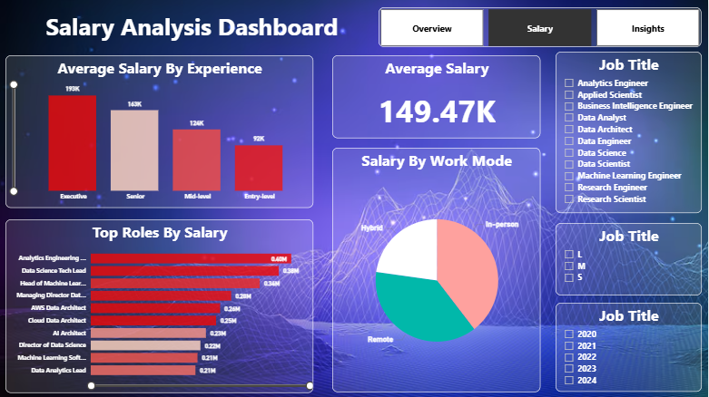

# 📊 Job Market & Salary Analysis Dashboard (Power BI)

🔗 **Live Demo:** [View Dashboard](https://app.powerbi.com/)  
📁 **Dataset:** [Public Job Market Dataset](https://www.kaggle.com/)  
📄 **Portfolio:** [Your Portfolio Website](https://divyarao0.github.io/portfolio)  
💼 **LinkedIn:** [Your LinkedIn](https://www.linkedin.com/in/divya-rao-2ab3942a6?utm_source=share&utm_campaign=share_via&utm_content=profile&utm_medium=android_app)

---

## 📌 Project Overview

The **Job Market & Salary Analysis Dashboard** is an interactive Power BI solution designed to analyze **job demand, salary trends, hiring patterns, and workforce distribution** across the global data job market.

This dashboard helps:
- Job seekers understand **in-demand roles & salary benchmarks**
- Recruiters analyze **hiring trends and work modes**
- Analysts explore **location-based workforce insights**

---

## 🧭 Dashboard Pages

### 1️⃣ Job Market Overview Dashboard

**Key Insights:**
- Total Jobs: **13.11K**
- Number of Unique Job Roles: **125**
- Most in-demand roles include:
  - Data Engineer
  - Data Scientist
  - Data Analyst
  - Machine Learning Engineer

**Visuals Included:**
- Most In-Demand Job Roles (Bar Chart)
- Jobs by Global Location (Map)
- Work Mode Distribution (Remote / Hybrid / In-person)
- Job Role, Company Size, and Year Filters

---

### 2️⃣ Salary Analysis Dashboard

**Key Metrics:**
- **Average Salary:** 149.47K
- Salary by Experience Level:
  - Executive
  - Senior
  - Mid-level
  - Entry-level

**Insights Provided:**
- Executives earn the highest average salaries
- Entry-level roles show lower but steady compensation growth
- Remote and hybrid roles dominate salary distribution

**Visuals Included:**
- Average Salary by Experience
- Top Roles by Salary
- Salary by Work Mode (Pie Chart)
- Dynamic Job Title & Year Filters

---

### 3️⃣ Job Market & Location Insights

**Key Highlights:**
- Top Hiring Countries:
  - United States
  - United Kingdom
  - Canada
  - Germany
- In-person roles remain dominant globally
- Medium-sized companies contribute the largest workforce share

**Visuals Included:**
- Hiring by Workspace Type
- Company Size Distribution
- Global Workforce Distribution Table
- Country-wise Job Distribution

---

## 🛠️ Tools & Technologies Used

- **Power BI Desktop**
- **DAX (Data Analysis Expressions)**
- **Power Query**
- **Data Modeling**
- **Interactive Visualizations**
- **Map Visuals (Bing Maps)**

---

## 📂 Dataset Information

- Source: Public job market & salary datasets
- Data includes:
  - Job Title
  - Salary
  - Experience Level
  - Work Mode
  - Company Size
  - Employee Residence
  - Year (2020–2024)

> ⚠️ Data is anonymized and used for educational & analytical purposes only.

---

## 🎯 Key Business Insights

- **Data Engineering and Data Science** roles dominate job demand
- **Remote work** has become a major employment mode
- **Senior and Executive** roles command significantly higher salaries
- **United States** leads global hiring in data-related roles
- **Medium-sized companies** are the largest employers in this domain

---

## 🚀 How to Use the Dashboard

1. Use **slicers** to filter by:
   - Job Title
   - Experience Level
   - Work Mode
   - Company Size
   - Year
2. Click on any visual to **cross-filter** other visuals
3. Navigate between pages using the **top navigation buttons**

---

## 📸 Dashboard Screenshots

### Job Market Overview

### Salary Analysis

### Location & Insights

---

## 📥 How to Access

### Option 1: Power BI Service (Recommended)
👉 [Open Live Dashboard](https://app.powerbi.com/)

### Option 2: Local Setup
1. Download the `.pbix` file from this repository
2. Open using **Power BI Desktop**
3. Refresh data if required

---

## 📌 Future Enhancements

- Add forecasting for salary trends
- Include industry-wise breakdown
- Integrate real-time job APIs
- Add drill-through pages for deep analysis

---

## 📄 License

This project is licensed under the **MIT License** — feel free to use, modify, and share.

---

## 🙌 Acknowledgements

- Kaggle & public job datasets
- Microsoft Power BI documentation
- Open-source data visualization community

---

### ⭐ If you like this project, consider giving it a star!
